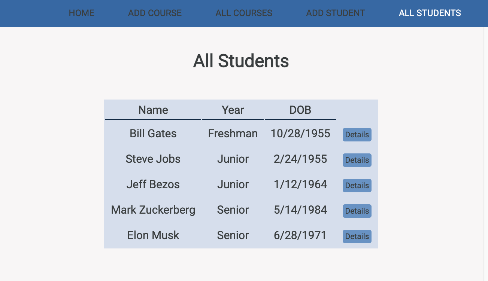

# Course Attendance App
The Course Attendance App is a CRUD web application managing student attendance.

# Screenshots

# Technologies Used

- HTML, CSS, JavaScript, EJS
- Node.js, Express.js, MongoDB, Mongoose
- Google OAuth 2.0 Authentication

# [Getting Started](http://course-attendance-app.herokuapp.com/)

1. Login in with your Google account.
1. Add a course.
1. Add a student.
1. Click Details button on a course.
1. Click Add to Attend button to add a student to a course.
1. Use Edit or Delete buttons on a course if needed.
1. Click Details button on a student.

# Next Steps

* A user should be able to click on an individual student and leave a comment.
* A user should be able to use a fully functional points-based attendance system.
* A user should be able to see each individual attendance rate.
